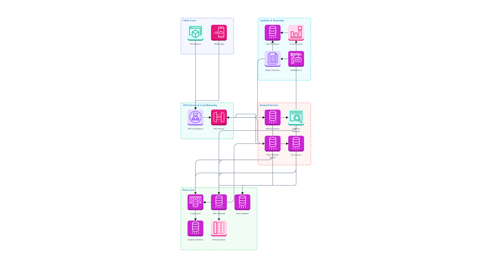

# Url-shortening
A full-stack URL Shortener and Analytics platform that converts long URLs into short, shareable links while tracking detailed click analytics. Built with React, FastAPI, PostgreSQL, and SQLAlchemy, with JWT-based authentication and an interactive analytics dashboard for monitoring URL performance.

# ARCHITECTURE DIAGRAM

